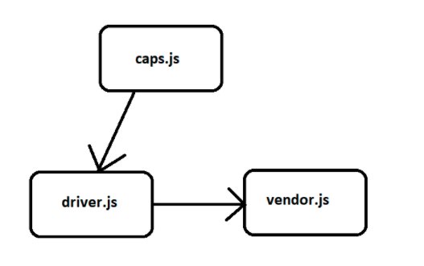

# CAPS
 - an application for a company called CAPS - The Code Academy Parcel Service.  i’ll build out a system that emulates a real world supply chain. CAPS will simulate a delivery service where vendors (such a flower shops) will ship products using our delivery service and when our drivers deliver them, be notified that their customers received what they purchased.

### Author: Hussein AL Mohamad

### Links and Resources

* [submission PR](https://github.com/Hussein-401-advanced-javascript/CAPS/pulls)

### Setup

* install  jest   ,faker

## Tests
Test:
 node index.js / npm test / npm run lint

#### UML

